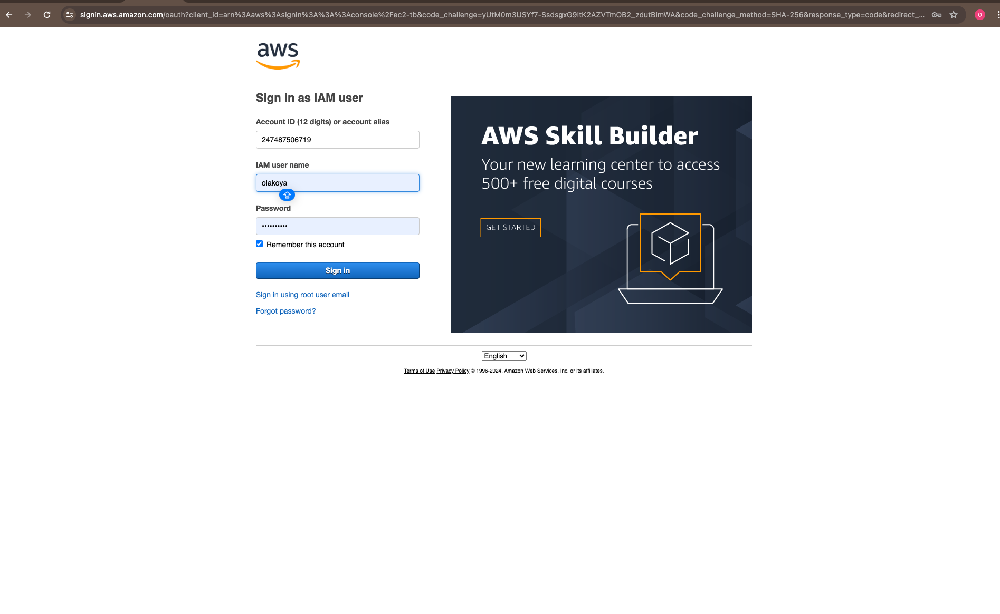
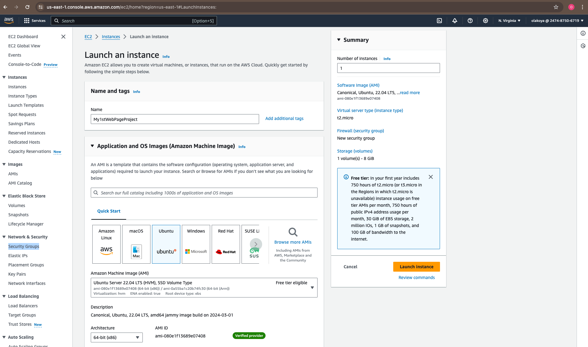
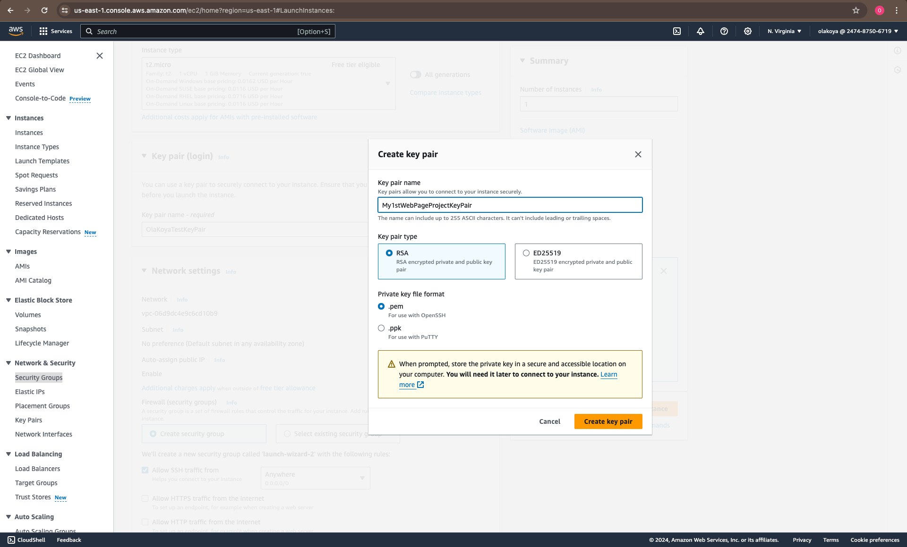
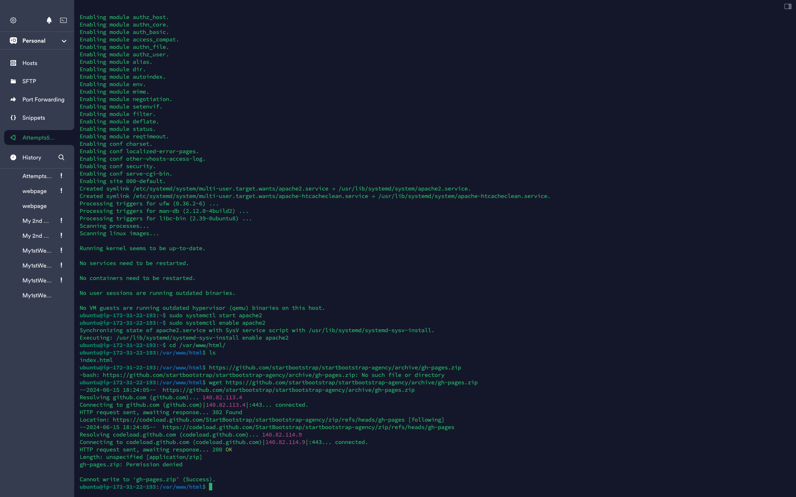
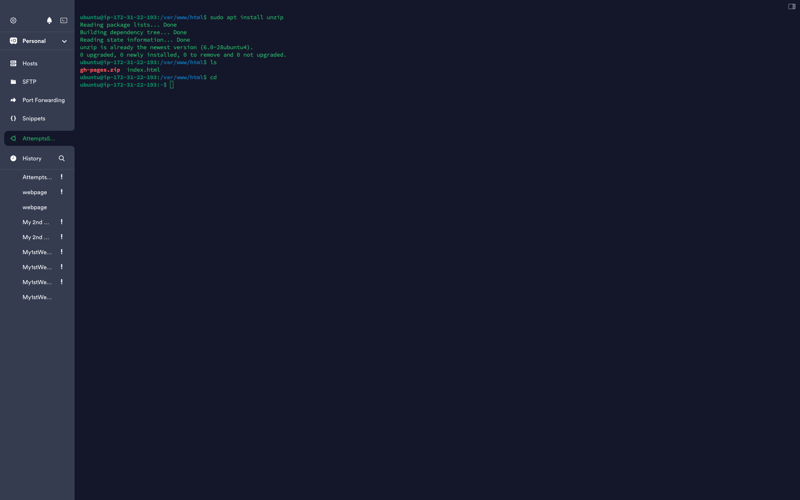

# PROJECT 1

## Step by Step guide to building and running a website on a Linux AWS instance with Ubuntu and Apache HTTP Server

### Screenshots and Codes Below;

**Step 1**

*Launch an AWS EC2 Instance: [Click Link to launch AWS EC2 Instance](https://eu-north-1.signin.aws.amazon.com/oauth?client_id=arn%3Aaws%3Asignin%3A%3A%3Aconsole%2Fcanvas&code_challenge=cXdQvTreRDJtf2HhUgZRo4umPqAvakdt0Ko84MTMy6w&code_challenge_method=SHA-256&response_type=code&redirect_uri=https%3A%2F%2Fconsole.aws.amazon.com%2Fconsole%2Fhome%3FhashArgs%3D%2523%26isauthcode%3Dtrue%26nc2%3Dh_ct%26oauthStart%3D1722627217132%26src%3Dheader-signin%26state%3DhashArgsFromTB_eu-north-1_f4c08861fcf016b9)*

>
1. Log in to your AWS Management Console;

---

2. Navigate to Console Home;

---
3. Navigate to the EC2 service;

---

4. Click on "Launch Instance" and select an Ubuntu Server AMI

---

5. Choose an instance type, configure instance details;

---

6. Create Keypair;

---

7. Newtwork Settings;

---

8. Add storage, configure security group settings to allow HTTP (port 80) traffic, and review and launch the instance;

---

9. Launch Instances by clicking on button to the rightside as seen in the screenshot above;

Click link to view Instance: [Connecting Instance Dashboard is Displayed](https://us-east-1.console.aws.amazon.com/ec2/home?region=us-east-1#Instances:)

---

**Step 2**

*Creating Security Group: [Click to view Security Group](https://us-east-1.console.aws.amazon.com/ec2/home?region=us-east-1#SecurityGroups:)*

>
10. Click on Security Group under Network & Security on the menu bar located at the left side of the page to open in a new page;

---

11. Assigning a name to my Security Group;

---

12. Give a description and selecting inbound rules and using the key pair selected during instance launch to authenticate;

---

13. Selecting outbound rules and Launching the Security Groups;

---

14. Created Security Groups Dashboard;

---

15. After the security group is created, I went back to my instance page and click on select existing security group then selected the one I had just created from the dropdown name options;

---

16. Then I clicked on launch instance;

---

17. Instance Groups page appears and I clicked on view all instances where it displays the states of all instances that are running, pending or terminated;

---

18. By clicking on the name box it displays details of running instances at the bottom of the page where to view IP address;

---

19. By clicking on connect button at the top of the instance page is to see the below page appears. Then I clicked on connect button below to confirm that my EC2 instance is connected and a terminal page is opened where it displays the details of my ubuntu is up and running - SSH (meaning who can view your website);

---

**Step 3**

*Update Package Lists:*

>
20. After connecting to the instance, update the package lists to ensure you have the latest versions available…. By opening your system terminal;

---

21. Open your framework i.e. Termius or VSC to create a host and click on new host;

---

22. Complete the opened host form to the right of the page with address -Public IP address from your running instance, General - new of project given in your running instance, credentials - ubuntu (name from your EC2 connect instance page) they must be the same name

---

23. Then I click on Password and select Key to add the Keypair I created when I was creating my security group on my EC2 instance;

---

24. I clicked on setting image at the top left corner of the terminal page and select keychain from the dropdown menu just as above;

---

25. Then I click on key tab at the top and click on drag and drop to attach my keypair from the download file or wherever I have saved it;

---

26. Then I click on Export to host after selecting my keypair;

---

27. And I select the name I use for the keypair from the dropdown menu;

---

28. After clicking on connect button from the image above to take me to the terminal page as seen on the screenshot below;

---

29. Then I clicked on continue button above and then the terminal below is displayed (Sql, Copy code, sudo apt update);

---

**Step 4**

*Install Apache:*

>
30. I installed the Apache web server using the package manager;

---

31. I entered code `sudo apt install apache2` into the terminal and clicked enter;

---

**Step 5**

*Start Apache:*

>
32. Once Apache is installed, I started the Apache service - `sql`;

---

33. Then I entered this Cmd `sudo systemctl start apache2`;

---

**Step 6**

*Enable Apache to Start on Boot*

>
34. Enable Apache to start automatically on boot bash `sudo systemctl enable apache2`;

---
**Step 7**

*Verify Apache Installation*

35. I check if Apache is running by accessing my server's (public IP address) in a web browser as I saw default Apache landing page indicating that Apache is working;

---
**Step 8**

*Configure Firewall (i.e if necessary)*

36. Below is screenshot of the output when I selected SSH instead of all network when I was creating my EC2 instance and above screenshot is when I selected all networks for both inbound and outbound when creating my instance. Bearing in mind that if a firewall is running on ones' instance, ensure to allow incoming HTTP traffic (port 80) to ones server. This can be done through AWS Security Groups or using a local firewall like UFW;

---
**Step 9**

*Testing my Website*

>
 - Accessing my website through a web browser using my server's public IP address or domain name to ensure it's working correctly.

 - I now have Apache running on a Ubuntu server in an AWS VM, serving my website. 

---

**Step 10**

*Deploying my Website*

>
37. Coping my website files to the appropriate directory on my Ubuntu server. By default, Apache serves files from the /var/www/html directory so I typed `cd /var/www/html/` into my terminal and `ls`;

---
38. Then I went to bootstrap page [https://startbootstrap.com/ ](https://startbootstrap.com/) to pick a webpage you I'd like to run on the srever and then clicked on it for the webpage to open;

---

39. Then I right click on free download button to copy the webpage link;

---

40. WARNINGS: To avoid this (I pasted the website link in the terminal as seen below in the terminal, if possible avoid this mistake because it is a zip address)

---

41. The cmd link returns says no such file because the file is in zip because I didn't add `wget` infront of the webpage link in the terminal;

---

42. Correct cmd used is `wget https://github.com/startbootstrap/startbootstrap-agency/archive/gh-pages.zip`

-  As you can see from above terminal screenshot that permission was denied to unzip because I didn't add `sudo` infront of the `wget` before I clicked enter;

---

43. After adding cmd `sudo wget https://github.com/startbootstrap/startbootstrap-agency/archive/gh-pages.zip` into the terminal, the return is saving the file to `gh-page.zip`;

---

44. Next is cmd `ls`

---

45. Then I enetered cmd `unzip gh-pages.zip` since the file couldn't be unzipped because I didn't add cmd `sudo` so, it gave me the command to use to avoid this mistake by rewriting the cmd with `sudo` as seen in the screenshot below;

---

46. Then I entered cmd `sudo apt install unzip` to unzip the file. Next `ls` and finally `cd` to come out of the `/var/www/html` file as seen below;

---

47. Next, I enetered cmd `sudo wget https://github.com/startbootstrap/startbootstrap-agency/archive/gh-pages.zip` and then `ls` into the terminal;

---

48. Then `unzip gh-pages.zip` to unzip file;

---

49. Then I entered cmd `ls` to view the unzipped file/webpage name/link;

---

50. And cmd `cd startbootstrap-agency-gh-pages` to go into the file;

---

51. Then cmd `ls`

---

52. Next cmd `sudo cp * -R /var/www/html/` to gain access into the weblink for my website;

---

53. Then cmd `ls` and next line `cd /var/www/html/` to enter into the apache file;

---

54. And cmd `ls`

---

55. I then navigate to the apache webpage were my ip address was once opened;

---

56. I refreshed the page for the website to appear or display;

---

The screenshot below shows the end result of another execution attempt.;

---

**I have attempted this same project five times, and it gets better, faster, and easier to execute each time.**
<<<<<<< HEAD
=======

---

End of Project!
